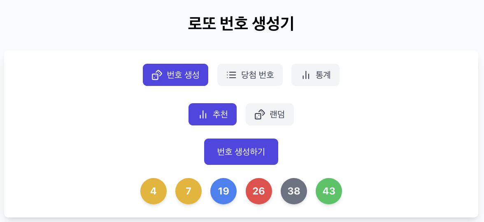
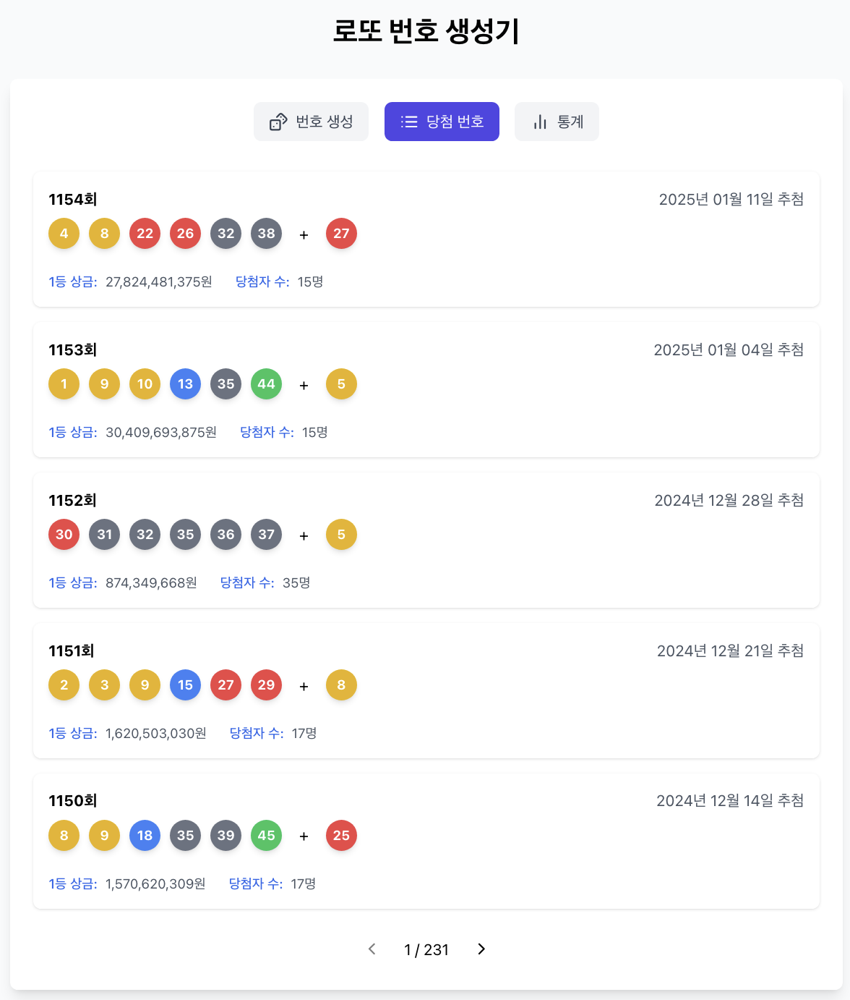
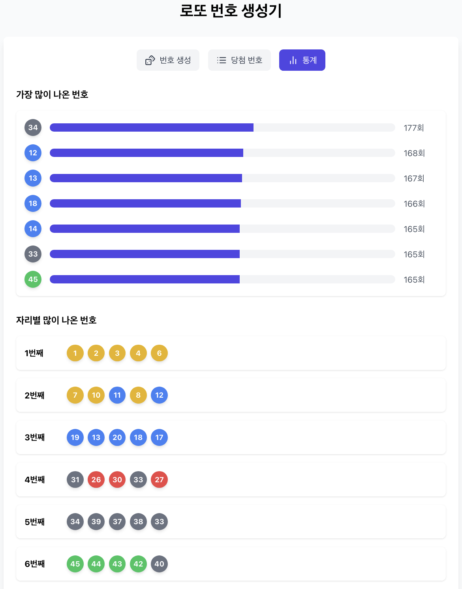

# 로또 번호 생성기_프론트엔드

https://seogineer.github.io/react-lotto-generator/





## 소개
- 랜덤으로 생성되는 번호뿐만 아니라 통계에 기반한 로또 번호 생성기
- 역대 당첨 번호와 가장 빈도 높은 번호의 통계를 조회

## 주요 기능
- 랜덤 번호 생성
- 통계에 기반한 번호 생성
- 역대 당첨 번호 조회
- 가장 많이 뽑힌 번호 조회
- 자리별 가장 많이 뽑힌 번호 조회

## 학습 목표
- React를 이용한 프론트엔드 개발
- Github pages를 이용한 배포

## 기술 스택
- 언어: Javascript
- 라이브러리: React
- 기타: HTML, CSS, Github pages

## 설치 및 실행
https://github.com/seogineer/kotlin-spring-lotto-generator

위 백엔드 서버가 동작하는 상태에서 아래 방법으로 프로젝트를 실행해야 정상 작동합니다.

```bash
git clone https://github.com/seogineer/react-lotto-generator.git
cd react-lotto-generator
npm run start
```